# Datenimport

Hitobito lösst verschiedene Systeme vom SAC/CAS ab. Um Datenfehler zu finden und vom SAC/CAS bereinigen zu lassen, soll
beim Import ein Report erstellt werden, der auf Validierungsfehler hinweist. Durch Abhängigkeiten und verschiedenen
Datenquellen, erfolgt der Import in mehreren Schritten. Schlussendlich sollen die Daten mittels des Imports ins
Hitobito migriert werden. Danach wird der hier beschriebene Datenimport nicht mehr benötigt.

## Ausführen der Imports auf Openshift

1. Im $RAILS_CORE_ROOT/tmp/sac_import_src/ die entsprechenden CSV-Dateien ablegen (Siehe [CSV Source Files](#csv-source-files))
1. In Openshift einloggen und in das gewünschte Projekt wechseln
1. Sicherstellen das das PVC mit dem Namen `sac-imports` vorhanden ist
1. hitobito_sac_cas/bin/ose-sac-import-shell ausführen
1. Beten das alles gut geht
1. In der Shell im rails-sac-imports Pod die gewünschten Imports ausführen
1. exit um die Shell zu verlassen
1. CSV Log files auf deinem Rechner in hitobito_sac_cas/tmp/sac_import-logs einsehen und ggf. an SAC weiterleiten

## Quelldaten

Die Daten bestehen aus verschiedenen .csv-Dateien. Die .csv-Dateien haben folgende Eigenschaften:

- **Encoding**: UTF-8
- **Delimiter**: ,
- **Zellen**: Zeichenketten umfasst mit "
- **Header**: erste Zeile

Die Dateien sind im Nextcloud abgelegt. **Die Daten dürfen nur anonymisiert im öffentlichen Bereich verwendet werden!**

| #    | Inhalt                                               | Art       |
|------|------------------------------------------------------|-----------|
| NAV1 | Alle Kontakte (natürliche und juristische Personen)  | via CSV   |
| NAV2 | Rollen und Gruppen                                   | via CSV   |
| NAV3 | Qualifikationen                                      | via CSV   |
| NAV5 | Hüttenbeziehungen (Hütten und Hüttenfunktionäre)     | via XLSX  |
| NAV6 | Sektionen und Ortsgruppen                            | via CSV   |
| NAV7 | Qualifikationsarten                                  | via Seeds |
| NAV8 | Austrittsgründe                                      | via CSV   |
| WSO21| Datenexport aus WSO21                                | via CSV   |

Weitere informationen sind in [HIT-490](https://saccas.atlassian.net/browse/HIT-490) zu finden.

Siehe [SacImports::CsvSource](../app/domain/sac_imports/csv_source.rb)

## Entwickler

- Zufällige Zeilen aus einer .csv-Datei in eine neue .csv-Datei schreiben:
  ```bash
  head -n 1 input.csv > output.csv && tail -n +2 input.csv | shuf -n 2000 >> output.csv
  ```
- `RAILS_SILENCE_ACTIVE_RECORD=1` kann die Geschwindigkeit des Imports erhöhen.
- In `/spec/fixtures/files/sac_imports_src/sac_imports_fixture.ods` werden die Fixtures verfasst und mit dem Skript `hitobito_sac_cas/spec/fixtures/files/sac_imports_src/export_sac_imports_fixture.sh` die jeweiligen Fixtures im CSV-Format erstellt. Es wird LibreOffice 7.2 oder neuer benötigt.

## CSV Report

Jeder Import erstellt einen CSV Report in RAILS_CORE_ROOT/log/sac_imports/. In diesem wird pro Import-Zeile eine Zeile im Report CSV erstellt.

`$IMPORT_NAME_$TIMESTAMP.csv`, e.g. `1_people_2024-06-01-12:00.csv`

Siehe [SacImports::CsvReport](../app/domain/sac_imports/csv_report.rb)

## Importe

```mermaid
flowchart LR
    A[Start] --> B(NAV6)
    B --> C(NAV1)
    C --> D(WSO21)
    D --> E(NAV2)
    E --> F(NAV3)
    F --> G(NAV5)
    G --> H(NAV8)
    H --> I[Ende 🎉]
```



### NAV1: `sac_imports:1_people`

Dieser Import sollte nach NAV6 ausgeführt werden.

You can run the import with: `RAILS_SILENCE_ACTIVE_RECORD=1 bundle exec rails sac_imports:1_people`

#### Diskrepanzen:

- `Street Name` und `Street No_`, sowie `Address` passen nicht immer zusammen, wobei `Street Name` und `Street No_` oft nicht ausgefüllt sind.

#### Hinweise:

- Geschlecht `2` bedeutet es handelt sich um eine Firma.

## NAV2: `sac_imports:2_roles`

Mit diesem Import werden alle Sektionen und Ortsgruppen importiert.
Auf jeder Sektion/Ortsgruppe werden auch Attribute wie z.B. Kanton, Gründungsjahr usw. gesetzt

`rake sac_imports:2_sektionen`

file: $CORE_ROOT/tmp/xlsx/sektionen.xlsx

- Importiert Sektionen/Ortsgruppen und erstellt deren Unterordnerstruktur

Import Source File: **NAV6**

## 3: sac_imports:3_huts

Importiert alle Hütten und hängt diese unter den Sektionen entsprechend ein. Ausserdem werden die Hüttenfunktionärs-Rollen gleich mitangelegt.

`rake sac_imports:huts`

file: $CORE_ROOT/tmp/xlsx/huetten_beziehungen.xlsx

Import Source File: **NAV5**

## 4: sac_imports:4_memberships

Importiert alle aktiven und inaktiven Stammsektions-Mitglied-Rollen.

`rake sac_imports:memberships FILE=tmp/xlsx/mitglieder_aktive.xlsx REIMPORT_ALL=true)`

Import Source File: **NAV2**

## 5: sac_imports:5_additional_memberships

Sicherstellen das Import Mitglieder Stammsektion bereits ausgeführt wurde. Eine Mitgliedschaft Zusatzsektion ist nur möglich falls bereits eine Mitglied Stammsektion Rolle vorhanden ist.

`rake sac_imports:5_additional_memberships FILE=tmp/xlsx/zusatzmitgliedschaften.xlsx REIMPORT_ALL=true)`

Import Source File: **NAV3**

## NAV6: sac_imports:6_sac_sections

`rake sac_imports:6_membership_years_report`

- Import Source File: **NAV1**
- CSV Report Output: `RAILS_CORE_ROOT/log/sac_imports/6_membership_years_report_2024-06-01-12:00.csv`

### Delete all Sektions

```ruby
Group::Ortsgruppe.all.each { |o| o.children.each(&:really_destroy!) }
Group::Sektion.all.find_each { |s| s.children.each(&:really_destroy!) }
Group::Sektion.all.find_each { |s| s.really_destroy! }
```

## 7: sac_imports:7_wso2_people

`rake sac_imports:7_wso2_people`

- Import Source File: **WSO21**
- CSV Report Output: `RAILS_CORE_ROOT/log/sac_imports/7_wso2_people_2024-06-01-12:00.csv`

## NAV8: via Seeds

Der Import erfolgt via Seeds in `hitobito_sac_cas/db/seeds/qualification_kinds.rb`.


